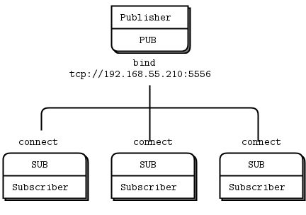
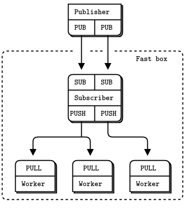

# ZeroMQ (ØMQ)

ZeroMQ, also known as ØMQ, is a high-performance asynchronous messaging library that provides messaging sockets for building distributed and concurrent applications. It enables developers to create robust and scalable communication patterns without the complexity of traditional messaging middleware.

## Key Concepts

### Socket Types

ZeroMQ provides several socket types, each with specific messaging patterns and behaviors:
- **REQ/REP**: Request-reply pattern for synchronous communication.
- **PUB/SUB**: Publish-subscribe pattern for asynchronous communication.
- **PUSH/PULL**: Pipeline pattern for distributing tasks among multiple workers.
- **PAIR**: Simple one-to-one communication for inter-process communication (IPC).

### Messaging Patterns

ZeroMQ supports various messaging patterns to address different communication requirements:

Pattern          | Description                                    | Image                                                                                              
------------------|-----------------------------------------------|:-----------------------------------------------------------------------------------------------------:
**Request-reply**| Sending requests from clients and receiving responses from servers using REQ/REP sockets.          |                                                                        
**Publish-subscribe** | Broadcasting messages from publishers to multiple subscribers using PUB/SUB sockets.       |                                                                 
**Pipeline**     | Distributing tasks among multiple workers using PUSH/PULL sockets.                               |                                                                 


### Zero-Copy Messaging

ZeroMQ minimizes message copying overhead by utilizing zero-copy techniques. Messages are passed between sockets without unnecessary copying, leading to improved performance and reduced latency.

### Fault Tolerance

ZeroMQ does not provide built-in features for fault tolerance or message persistence. However, developers can implement fault tolerance mechanisms using patterns like heartbeating, reconnect logic, and message acknowledgment.

### Basic Usage

ZeroMQ provides a simple and intuitive API for creating sockets, sending and receiving messages, and managing communication patterns. Below is a basic example in Python:

```python
import zmq

# Create a ZeroMQ context
context = zmq.Context()

# Create a socket of type PUB (Publisher)
socket = context.socket(zmq.PUB)

# Bind the socket to an address
socket.bind("tcp://*:5555")

# Publish a message
socket.send(b"Hello, ZeroMQ!")
